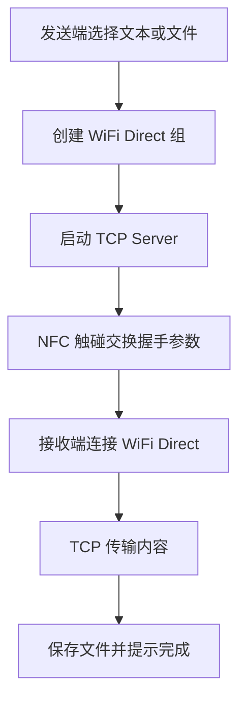

# nfcmi

`nfcmi` 是一个 Android 个人学习项目，用 Kotlin 实现“两台 Android 手机通过 NFC 触碰后互传文本/文件”。

核心思路：

- NFC 负责近场触发和交换会话参数。
- WiFi Direct 负责建立 Android 到 Android 的点对点连接。
- TCP socket 负责真实文本和文件传输。

本项目不使用 Android Beam，也不接入第三方互传库。

## 当前状态

已包含：

- Android `app` 模块
- NFC HCE 握手服务
- NFC ReaderMode 接收端
- WiFi Direct 建组/连接封装
- TCP 文本和文件传输
- 简单原生 Android UI
- GitHub Actions 自动编译 Debug APK

APK 会在 GitHub Actions 的构建产物里生成，artifact 名称为 `nfcmi-debug-apk`。

## GitHub Actions 编译 APK

工作流文件：

```text
.github/workflows/build.yml
```

触发方式：

- push 到 `main`
- pull request 到 `main`
- 在 GitHub Actions 页面手动点击 `Run workflow`

构建完成后，在 Actions 运行详情页下载：

```text
nfcmi-debug-apk
```

其中包含 Debug APK。

## 本地构建

开发环境：

- Android Studio
- JDK 17
- Gradle 9.5.0
- Android Gradle Plugin 9.3.0
- Android SDK Platform 37

构建命令：

```bash
gradle --no-daemon :app:assembleDebug
```

生成位置：

```text
app/build/outputs/apk/debug/
```

## 项目结构

```text
nfcmi/
├── .github/workflows/build.yml
├── app/
│   ├── build.gradle.kts
│   └── src/main/
│       ├── AndroidManifest.xml
│       ├── java/com/chl/nfcmi/
│       │   ├── nfc/        # NFC HCE、ReaderMode、NDEF 编解码
│       │   ├── wifi/       # WiFi Direct 建组、发现、连接
│       │   ├── transfer/   # TCP 传输协议、发送端、接收端
│       │   └── ui/         # 发送/接收界面
│       └── res/
├── build.gradle.kts
├── settings.gradle.kts
└── gradle.properties
```

## 传输流程



## 为什么不用 Android Beam

Android Beam 从 Android 10/API 29 开始已经废弃，新系统和部分厂商 ROM 上的 P2P NDEF Push 不可靠。

本项目改用：

- 发送端：Host Card Emulation
- 接收端：ReaderMode
- 握手格式：`NdefMessage` / `NdefRecord`

NFC 只传小数据，例如：

- `sessionId`
- 一次性 `token`
- WiFi Direct 设备地址
- TCP 端口
- 文件名、MIME 类型、大小等元数据

真实文件内容不走 NFC。

## 权限

主要权限：

- `NFC`
- `INTERNET`
- `ACCESS_NETWORK_STATE`
- `CHANGE_NETWORK_STATE`
- `ACCESS_WIFI_STATE`
- `CHANGE_WIFI_STATE`
- `ACCESS_FINE_LOCATION`
- `NEARBY_WIFI_DEVICES`

文件选择使用系统文件选择器，尽量避免申请过大的存储权限。

## 真机测试注意事项

这个项目必须用两台 Android 真机测试，模拟器基本测不了完整流程。

重点验证：

- 两台手机 NFC 线圈位置是否容易触发。
- HCE 是否能被系统正确路由到本应用。
- ReaderMode 是否能稳定读取握手数据。
- WiFi Direct 是否能发现并连接对方设备。
- `WifiP2pManager.connect()` 是否弹出系统确认框。
- Android 13+ 权限和定位开关是否影响发现。
- 大文件传输时 App 切后台是否会被系统杀掉。

## 后续计划

- 增加前台服务，提升大文件传输稳定性。
- 增加 SHA-256 完整性校验。
- 增加手动选择 WiFi Direct peer 的兜底模式。
- 优化 UI 和错误提示。
- 整理不同手机型号的兼容性记录。

## License

个人学习项目，License 待定。
