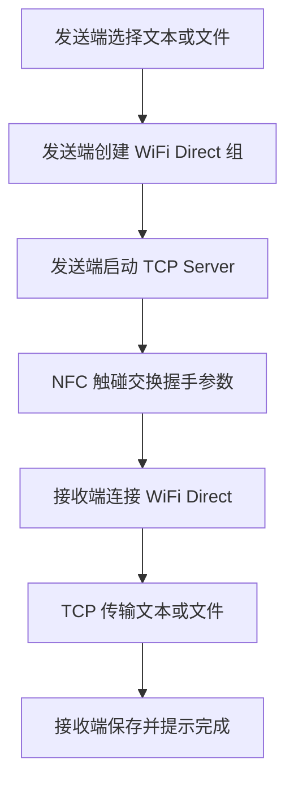

# nfcmi

`nfcmi` 是一个 Android 个人学习项目，目标是实现两台 Android 手机触碰后互传文本和文件。

项目方案不是 Android Beam，也不是第三方互传库，而是：

- NFC 只负责近场触发和交换握手参数。
- WiFi Direct 负责建立点对点连接。
- TCP socket 负责真实内容传输。

> 当前仓库还处于初始化阶段：已经提交 Gradle Wrapper 和根构建配置，但 `app/` Android 模块还没有提交。因此现在的仓库不能直接编译 APK。下面文档描述的是本仓库的目标架构和接下来要落地的实现。

## 为什么不用 Android Beam

Android Beam 从 Android 10/API 29 开始已经废弃，新系统和部分厂商 ROM 上的 P2P NDEF Push 不可靠。

本项目后续会使用更底层、可控的 NFC 方案来做握手：

- 发送端：Host Card Emulation，模拟一张只提供握手数据的 NFC 卡。
- 接收端：ReaderMode，读取发送端暴露的握手数据。
- 数据格式：`NdefMessage` / `NdefRecord`。

NFC 只传小数据，例如：

- `sessionId`
- 一次性 `token`
- WiFi Direct 设备标识
- TCP 端口
- 文件名、MIME 类型、大小等元数据

真实文件内容不走 NFC。

## 传输流程



## 目标功能

- 发送文本内容。
- 发送图片或任意文件。
- NFC 触碰后自动交换会话参数。
- WiFi Direct 自动建连。
- 传输进度显示。
- 接收完成后保存文件并提示用户。
- 不依赖第三方文件互传 SDK。

## 计划中的项目结构

```text
nfcmi/
├── app/
│   └── src/main/
│       ├── AndroidManifest.xml
│       ├── java/com/chl/nfcmi/
│       │   ├── nfc/        # NFC HCE、ReaderMode、NDEF 编解码
│       │   ├── wifi/       # WiFi Direct 建组、发现、连接
│       │   ├── transfer/   # TCP 传输协议、发送端、接收端
│       │   └── ui/         # 简单发送/接收界面
│       └── res/
├── build.gradle.kts
├── settings.gradle.kts
├── gradle.properties
└── gradle/wrapper/
```

## 当前仓库状态

已提交：

- Gradle Wrapper
- `settings.gradle.kts`
- 根目录 `build.gradle.kts`
- `gradle.properties`
- README

待补齐：

- `app/` Android 应用模块
- `AndroidManifest.xml`
- NFC 握手代码
- WiFi Direct 连接代码
- TCP 文件传输代码
- UI 页面
- 真机测试记录

## 开发环境

- Android Studio
- JDK 17
- Gradle 9.5.0
- Android Gradle Plugin 9.3.0
- Kotlin
- 两台支持 NFC 和 WiFi Direct 的 Android 真机

当前根构建配置使用：

```kotlin
plugins {
    id("com.android.application") version "9.3.0" apply false
}
```

## 构建方式

当前仓库还缺少 `app/` 模块，暂时不能直接构建。

待 `app/` 模块补齐后，使用：

```bash
./gradlew :app:assembleDebug
```

或直接使用 Android Studio 打开项目并运行到真机。

## Android 权限规划

后续 `AndroidManifest.xml` 至少需要包含：

```xml
<uses-permission android:name="android.permission.NFC" />
<uses-permission android:name="android.permission.INTERNET" />
<uses-permission android:name="android.permission.ACCESS_NETWORK_STATE" />
<uses-permission android:name="android.permission.CHANGE_NETWORK_STATE" />
<uses-permission android:name="android.permission.ACCESS_WIFI_STATE" />
<uses-permission android:name="android.permission.CHANGE_WIFI_STATE" />
<uses-permission android:name="android.permission.ACCESS_FINE_LOCATION" />
<uses-permission android:name="android.permission.NEARBY_WIFI_DEVICES" />

<uses-feature android:name="android.hardware.nfc" android:required="true" />
<uses-feature android:name="android.hardware.nfc.hce" android:required="true" />
<uses-feature android:name="android.hardware.wifi.direct" android:required="true" />
```

说明：

- WiFi Direct 设备发现通常需要定位权限。
- Android 13/API 33+ 需要 `NEARBY_WIFI_DEVICES`。
- 文件选择建议走系统文件选择器，避免申请过大的存储权限。

## 实现重点

### NFC 层

NFC 只做握手，不传文件。

计划实现：

- `HceHandshakeService`
- `NfcReader`
- `NfcHandshakeCodec`
- `NfcPayloadStore`

握手数据使用 `NdefMessage` 封装，再通过 HCE/ReaderMode 读取。

### WiFi Direct 层

发送端优先作为 Group Owner，接收端作为 Client。

计划处理：

- WiFi Direct 是否启用
- 当前设备信息
- Peer discovery
- Group Owner/Client 角色
- 连接状态广播
- 失败重试和系统确认弹窗

### Transfer 层

文件内容通过 TCP socket 传输。

计划协议：

1. 先发送 4 字节 header 长度。
2. 再发送 JSON header。
3. 最后发送文本或文件字节流。

header 中包含：

- `sessionId`
- `token`
- `payloadKind`
- `displayName`
- `mimeType`
- `sizeBytes`

`token` 用于防止误连设备直接接收数据，但它不是加密。后续如果传敏感文件，需要增加 TLS 或端到端加密。

## 真机测试清单

这个项目必须用两台真机测，模拟器基本没有意义。

需要重点验证：

- 两台手机 NFC 线圈位置是否容易触发。
- HCE 是否能被系统正确路由到本应用。
- 接收端 ReaderMode 是否能稳定读取握手数据。
- WiFi Direct 是否能发现对方设备。
- 发送端作为 Group Owner 是否稳定。
- `WifiP2pManager.connect()` 是否弹出系统确认框。
- Android 13+ 权限和定位开关是否影响发现。
- 大文件传输时 App 切后台是否会被系统杀掉。

## 后续计划

- 补齐 `app/` 模块。
- 完成 NFC HCE + ReaderMode 握手。
- 完成 WiFi Direct 自动建连。
- 完成文本和文件传输。
- 增加传输进度、速度和失败提示。
- 增加 SHA-256 完整性校验。
- 增加前台服务，支持大文件长时间传输。
- 整理真机兼容性记录。

## License

个人学习项目，License 待定。
